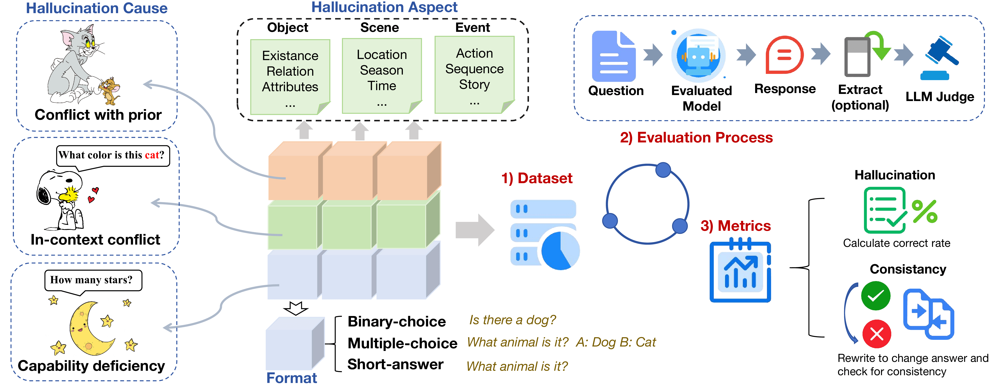

## Exploring Hallucination of Large Multimodal Models in Video Understanding: Benchmark, Analysis and Mitigation

<p align="center">
  <a href="">Website</a> •
  <a href="https://arxiv.org/abs/2503.19622">Paper</a>•
  <a href="./Data/test_data.json">Data</a> 
</p>

## 📰 News
- **2025-05-14**: We released the [full dataset](https://huggingface.co/datasets/Joshua999/HAVEN) at huggingface!
- **2025-03-26**: We released the [paper](https://arxiv.org/abs/2503.19622) at arxiv. 
- **2025-03-20**: We released a subset of HAVEN dataset containing 1,200 questions and evaluation code. 


## 👋 Overview



### 🧐 Why HAVEN?
Previous research on hallucinations of LMMs has primarily focused on image understanding, as earlier LMMs could not process video inputs. These benchmarks are designed to evaluate hallucinations involving factors such as objects, relationships and attributes in a single image.

With advancements in multi-modal technologies, numerous LMMs now support video processing. Although many of these models did not incorporate audio inputs from videos, most can effectively process the visual content of video. Unlike image understanding, videos consist of sequences of multiple image frames over time, making video understanding more complex. It requires the analysis of continuous temporal dynamics, including sequential changes in human actions, object movements, and scene transitions. Hence, hallucinations in video understanding also differ from those in images.

To address the concern above, we proposed a benchmark for **HAllucination in Video UndErstaNding (HAVEN)**. HAVEN is meticulously designed to quantitatively evaluate the hallucination in video understanding for LMMs, which is constructed based on the following dimensions:

- Three **causes** of hallucinations: conflict with prior knowledge, in-context conflict, and inherent capability deficiencies of LMMs.
- Three types of hallucination **aspects** in a video: object, scene, and event.
- Three **formats** of questions: binary-choice, multiple-choice, and short-answer.


### 📈Data
Our video data comprises videos from three public video datasets ([COIN](https://coin-dataset.github.io/), [ActivityNet](http://activity-net.org/download.html), and [Sports1M](https://github.com/gtoderici/sports-1m-dataset) and manually collected video clips from Internet. You can directly download the video from our provided source link.

Here is an example of our data:
```json
{
  "Index": 1,
  "Question": "Are the individuals in the video sewing garments with thread?",
  "Answer": "No",
  "Causes": "Conflict with prior",
  "Aspects": "Event",
  "Form": "Binary-choice",
  "Source Link": "https://www.youtube.com/embed/xZecGPPhbHE",
  "Begin": "0:29",
  "End": "0:40",
  "Video Path": "Coin0001",
  "Group_id": "Coin_group0001"
}
```

#### Explanation of Fields:  
- **Index**: The global question index, indicating the sequential order of all benchmark questions.  
- **Causes**: Represents the cause of hallucination, corresponding to the categories introduced in the paper:  
  - *Conflict with prior knowledge*: The model generates answers that contradict well-established knowledge.  
  - *In-context conflict*: The model produces contradictory answers within the given video context.  
  - *Capability deficiency*: The model lacks the ability to recognize or reason about the given video content.  
- **Aspects**: Defines the hallucination category based on video content:  
  - *Object*: Hallucinations related to incorrect object recognition.  
  - *Scene*: Misinterpretations of scene context.  
  - *Event*: Incorrect understanding of events or actions within the video.  
- **Form**: Represents the question format, aligning with the paper's categorization:  
  - *Binary-choice*: A question with two answer choices (e.g., True/False, Yes/No).  
  - *Multiple-choice*: A question with multiple answer choices, requiring the selection of the most appropriate one.  
  - *Short-answer*: A question requiring a direct response without predefined options.  
- **Source Link**: The original video file path. If the video is from ActivityNet, it can be downloaded from [here](http://activity-net.org/download.html).  
- **Begin, End**: Indicate the start and end timestamps of the relevant video segment.  
- **Video Path**: The unique identifier for the video. The same Video Path across multiple entries means they reference the same video clip.  
- **Group_id**: A group identifier for related questions, used to analyze model consistency across different questions related to the same content. 
  - Identical `group_id` values indicate different variations of the same question.  
  - The prefix of `group_id` indicates the dataset from which the question originates. For example:  
    - `coin_groupXXXX` refers to the *COIN* dataset.  
    - `Sports1M_groupXXXX` refers to the *Sports1M* dataset.  
    - `ActivityNet_groupXXXX` refers to the *ActivityNet* dataset.  
    - `YouTube_groupXXXX` refers to videos on *YouTube*. 


## 🚀 Quickstart

### 📜 Key Scripts 
- **Inferring Script** (`Infer.py`) – This script runs the model on the dataset.  
- **Judging Script** (`Judge.py`) – Uses GPT-4o-mini to assess the model’s predictions.

### 🏗 Running the Scripts 
**Testing a single Model**
- **🛠️ Setup Before Running** - Following the notation below, edit parameters in `run_eval_single_model.sh`.
  Select **model_name** based on the model name provided in the **model name** parameter of **Infer.py**.

```bash
#!/bin/bash

MODEL_NAME="name of your model"
VIDEO_PATH="path/to/video/files"
OUTPUT_PATH="path/to/final/output"
DATASET_PATH="Data/test_data.json"
ANSWER_FILE="path/to/answer.json"
API_KEY="your_api_key_here"
GPT_URL="your_gpt_url_here"

echo "Running Infer.py..."
python Infer.py --model_name "$MODEL_NAME" --video_path "$VIDEO_PATH" --output_file "$ANSWER_FILE" --dataset_path "$DATASET_PATH"

echo "Running Judge.py..."
python Judge.py --model_name "$MODEL_NAME" --answer_file "$ANSWER_FILE" --output_file "$OUTPUT_PATH" --api_key "$API_KEY" --GPT_url "$GPT_URL"

echo "Inference and judgement completed!"
```

- **▶ Run with One Command** – Simply run:  
   ```bash
   bash run_eval_single_model.sh
   ```
**Testing all Models**
- **🛠️ Setup Before Running** - Edit parameters in `run_eval_single_model.sh` in the same way (No need to specify model names!).
- **▶ Run with One Command** – Simply run:  
   ```bash
   bash run_eval.sh
   ```
   
### 📂 Output Files
- **Inference results**: `{args.model_name}_infer_result.json`  
- **Judgement results**: `{args.model_name}_judge_result.json`  


## 🙇‍♂️ Acknowledgement


## ✍️ Citation
If you find our work helpful, please cite as
```
@misc{gao2025exploringhallucinationlargemultimodal,
      title={Exploring Hallucination of Large Multimodal Models in Video Understanding: Benchmark, Analysis and Mitigation}, 
      author={Hongcheng Gao and Jiashu Qu and Jingyi Tang and Baolong Bi and Yue Liu and Hongyu Chen and Li Liang and Li Su and Qingming Huang},
      year={2025},
      eprint={2503.19622},
      archivePrefix={arXiv},
      primaryClass={cs.CV},
      url={https://arxiv.org/abs/2503.19622}, 
}
```

